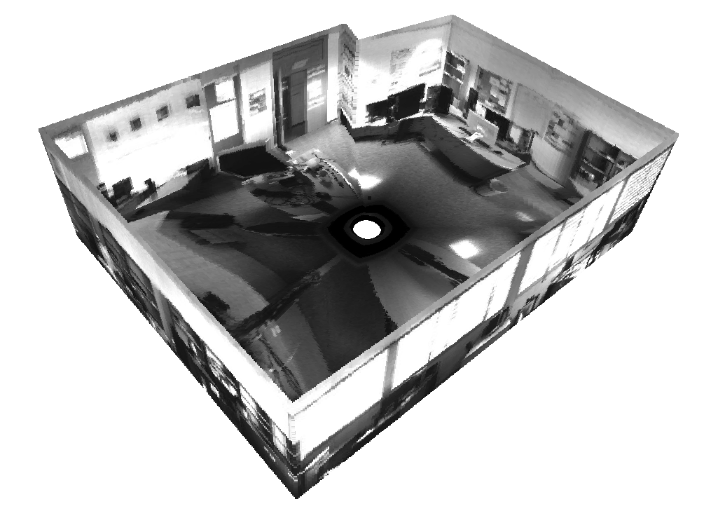
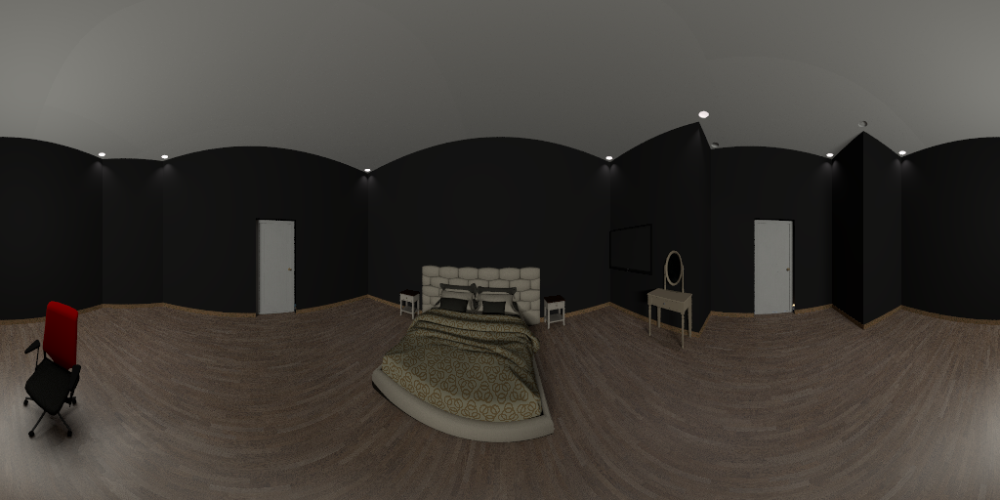
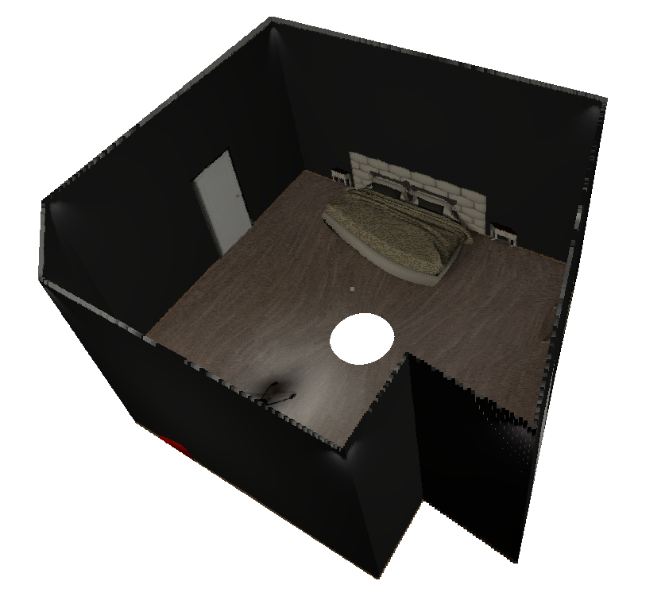

# Scaled 360 Layouts
This code belongs to the investigation presented in the paper [Scaled 360 Layouts: Revisiting non-central panoramas](https://openaccess.thecvf.com/content/CVPR2021W/OmniCV/papers/Berenguel-Baeta_Scaled_360_Layouts_Revisiting_Non-Central_Panoramas_CVPRW_2021_paper.pdf) from the 2nd OmniCV Workshop. 

```bibtex
@inproceedings{berenguel2021scaled,
  title={Scaled 360 Layouts: Revisiting Non-Central Panoramas},
  author={Berenguel-Baeta, Bruno and Bermudez-Cameo, Jesus and Guerrero, Jose J},
  booktitle={Proceedings of the Conference on Computer Vision and Pattern Recognition Workshop},
  pages={3702--3705},
  year={2021},
  organization={IEEE}
}
```

The work and results are extended in [Atlanta Scaled Layouts from Non-central Panoramas](https://www.sciencedirect.com/science/article/pii/S0031320322002217)

```bibtex
@article{berenguel2022atlanta,
  title={Atlanta Scaled Layouts from Non-central Panoramas},
  author={Berenguel-Baeta, Bruno and Bermudez-Cameo, Jesus and Guerrero, Jose J},
  booktitle={Pattern Recognition},
  year={2022},
  organization={Elsevier},
  doi = {https://doi.org/10.1016/j.patcog.2022.108740}
}
```

# Code
<p align="center">


</p>
<p align="center">


</p>

Code for scaled layout recovery from single non-central panoramas.
Includes the Neural Network architecture (based on the code of [HorizonNet](https://github.com/sunset1995/HorizonNet) ) and weights of the fine-tuned version to handle non-central panoramas. We also present the geometrical processing to obtain scaled layouts from non-central panoramas and the programs and metrics used to obtain the results presented in our paper.

The data-set used to fine-tune the network and perform the experiments can be found as [Non Central Indoor Dataset](https://github.com/jesusbermudezcameo/NonCentralIndoorDataset)

To download the weigths used in the articles, click [Here](https://drive.google.com/drive/folders/1h7bK8GY5Alaapb5G075wcAw3Or5s5J9P?usp=sharing)

In order to set-up the packages or virtual environment to run the repository, we provide a requirements file for two different cases. [requirementsU20.txt](https://github.com/Sbrunoberenguel/scaledLayout/blob/main/requirementsU20.txt) is set to use in Ubuntu 20.04 (it also works in Ubuntu 18.04) as: 
```bash
pip install -r requirementsU20.txt
```
To set up the repository in Windows, we recommend the use of [Anaconda](https://www.anaconda.com) with cuda 10.2 and use [requirementsCondaW64.txt](https://github.com/Sbrunoberenguel/scaledLayout/blob/main/requirementsCondaW64) as:
```bash
conda create --name layoutsEnv python=3.8  --file requirementsCondaW64.txt
```

The most common problem in the instalation process comes with Pytorch and shapely packages. If that is the case, after the requirements, you can install the packages manually (either in Ubuntu or Windows) as:
```bash
conda install pytorch==1.9.0 torchvision==0.10.0 torchaudio==0.9.0 cudatoolkit=10.2 -c pytorch
conda install shapely==1.7.1
conda install -c anaconda scikit-learn=0.23.2
```

## Inference
Once installed the requirements to get the proper packages and versions, you must run the 'main.py' file to get the layout reconstruction from the non-central panoramas. You will get the 3D reconstruction as a '*.mat*' file. This file is a python dictionary which contains:</p>

{'CeilCorners': 3D corners of the ceiling of the room in meters;</p>
'FloorCorners': 3D corners of the floor of the room in meters;</p>
'CeilLines': intersection lines of ceiling and walls in Plücker coordinates;</p>
'FloorLines': intersection lines of floor and walls in Plücker coordinates;</p>
'RoomReconstruction': colored point cloud of the room layout}</p>

To use the example images just run:
```bash
python main.py --input_path img/ --out_dir Results --pth ckpt/NCIndoor.pth
```

If you want to visualize the 3D layout after it is computed, include at the end of the previous command _**--visualize**_

# Note from the authors
This code has not been thoroughly tested, which means it may have some bugs. **Please use with caution.**

The authors and developers of this code want the best for the users and have gone to great lengths to make it easy to use and accessible. 
Be nice to them and enjoy their work.

If any problem may appear, do not hesitate and we will do our best to solve it (at least we will try).

# License
This software is under GNU General Public License Version 3 (GPLv3), please see GNU License

For commercial purposes, please contact the authors: Bruno Berenguel-Baeta (berenguel@unizar.es), Jesús Bermudez-Cameo (bermudez@unizar.es) and Josechu Guerrero (josechu.guerrero@unizar.es)
